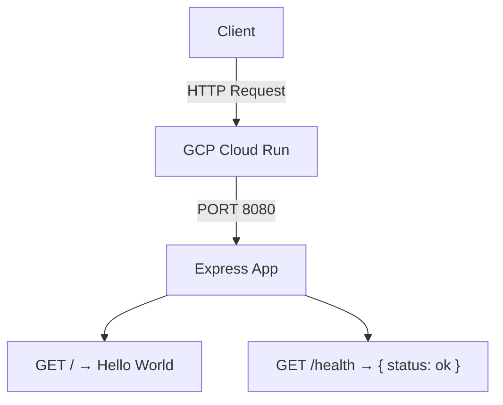

# GCP Cloud Run API

TypeScript REST API built with Express 5, containerised with Docker, and deployed to GCP Cloud Run via Terraform.

## Tech Stack

| Layer | Technology |
|---|---|
| Runtime | Node.js 22 |
| Framework | Express 5 |
| Language | TypeScript 5 |
| Container | Docker (multi-stage build) |
| Platform | GCP Cloud Run |
| IaC | Terraform ≥ 1.4 · google provider ~> 6.0 |
| CI | GitHub Actions · reviewdog |

## Project Structure

```
.
├── src/
│   ├── index.ts        # entry point — creates server, binds PORT
│   └── app.ts          # Express app (routes)
├── terraform/
│   ├── main.tf         # Cloud Run, Artifact Registry, IAM, service account
│   ├── variables.tf    # project_id, region, service_name, image_tag
│   ├── outputs.tf      # service_url, image_url, registry_url
│   └── versions.tf     # provider constraints
├── docs/
│   ├── diagram.py      # generates docs/gcp-infrastructure.png
│   └── gcp-infrastructure.png
├── Dockerfile
└── .github/workflows/
    └── code-review.yml # PR checks: tests · ESLint · tsc · Prettier
```

## API Endpoints

| Method | Path | Response |
|---|---|---|
| GET | `/` | `Hello World` |
| GET | `/health` | `{ "status": "ok" }` |

## Prerequisites

- Node.js 22+
- Docker
- Terraform ≥ 1.4 (for infrastructure)
- `gcloud` CLI authenticated (for infrastructure)

## Local Development

```bash
npm install

npm run dev          # run with ts-node — no build step required
npm run build        # compile TypeScript → dist/
npm start            # run compiled output from dist/
```

The server reads `PORT` from the environment and defaults to `8080`.

## Testing & Linting

```bash
npm test             # Jest unit tests (ts-jest)
npm run lint         # ESLint
npm run format:check # Prettier check
npx tsc --noEmit     # type-check without emitting files
```

## Docker

```bash
# Build
docker build -t gcp-cloud-run-api .

# Run (mirrors Cloud Run behaviour)
docker run -p 8080:8080 gcp-cloud-run-api
```

The Dockerfile uses a multi-stage build: compiles TypeScript in the builder stage, then copies only `dist/` and production dependencies to the final image.

## Infrastructure (Terraform)

All GCP resources live in `terraform/`. Required variables:

| Variable | Description | Default |
|---|---|---|
| `project_id` | GCP project ID | — |
| `region` | GCP region | `us-central1` |
| `service_name` | Name shared by all resources | `gcp-cloud-run` |
| `image_tag` | Docker image tag to deploy | `latest` |

```bash
cd terraform

terraform init

terraform apply \
  -var="project_id=YOUR_PROJECT_ID" \
  -var="region=us-central1"
```

After `apply`, Terraform prints:

| Output | Description |
|---|---|
| `service_url` | Public Cloud Run HTTPS URL |
| `artifact_registry_repository_url` | Base URL for `docker push` |
| `image_url` | Full image URL currently deployed |

### Push an image

```bash
# Authenticate Docker with Artifact Registry
gcloud auth configure-docker us-central1-docker.pkg.dev

# Tag and push
docker tag gcp-cloud-run-api \
  us-central1-docker.pkg.dev/YOUR_PROJECT_ID/gcp-cloud-run/gcp-cloud-run:latest

docker push \
  us-central1-docker.pkg.dev/YOUR_PROJECT_ID/gcp-cloud-run/gcp-cloud-run:latest
```

## CI/CD

GitHub Actions runs on every pull request.

**`code-review.yml`** — triggered on all PRs:

1. **Unit tests** — `npm test`
2. **ESLint** — inline PR annotations via reviewdog
3. **Type check** — `tsc --noEmit`
4. **Prettier** — format check

**`terraform-ci.yml`** — triggered on PRs that touch `terraform/`:

1. **Format check** — `terraform fmt -check`
2. **Init** — `terraform init -backend=false`
3. **Validate** — `terraform validate`
4. **Plan** — runs `terraform plan` and posts the output as a PR comment

Required GitHub secrets/variables for the Terraform plan step:

| Name | Type | Description |
|---|---|---|
| `TF_VAR_PROJECT_ID` | Secret | GCP project ID |
| `GCP_SA_KEY` | Secret | Service account key JSON with enough permissions to plan |
| `TF_VAR_REGION` | Variable | GCP region (defaults to `us-central1` if not set) |

## Architecture



## GCP Infrastructure

Resources provisioned by Terraform in `terraform/`. Diagram generated by [`docs/diagram.py`](docs/diagram.py).


