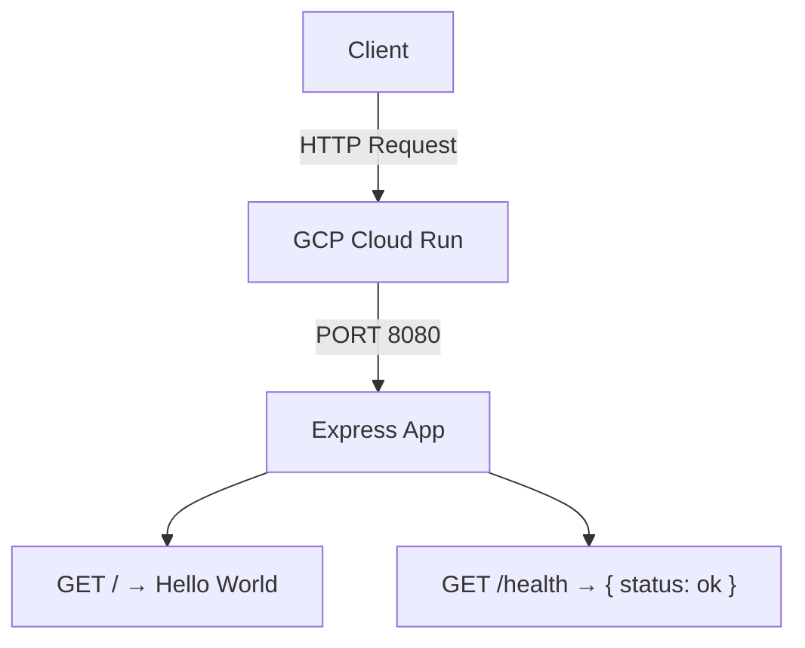

# GCP Cloud Run API

TypeScript REST API scaffolded for deployment on GCP Cloud Run.

## Tech Stack

| Layer | Technology |
|-------|------------|
| Runtime | Node.js 22 |
| Framework | Express 5 |
| Language | TypeScript 5 |
| Container | Docker (multi-stage build) |
| Platform | GCP Cloud Run |

## API Endpoints

| Method | Path | Response |
|--------|------|----------|
| GET | `/` | `Hello World` |
| GET | `/health` | `{ "status": "ok" }` |

## Local Development

```bash
npm run dev    # run locally with ts-node (no build step)
npm run build  # compile TypeScript to dist/
npm start      # run compiled output
```

## Docker

```bash
# Build the image
docker build -t gcp-cloud-run-api .

# Run the container
docker run -p 8080:8080 gcp-cloud-run-api
```

## Architecture


# gcp-cloud-run
